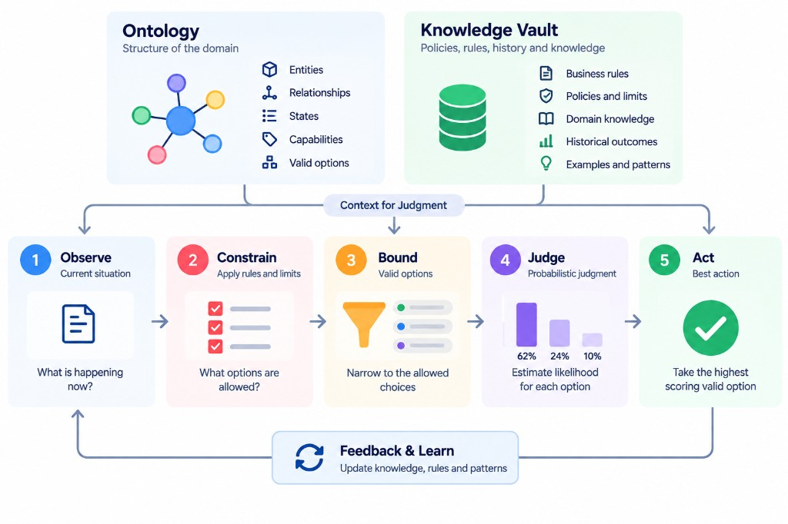
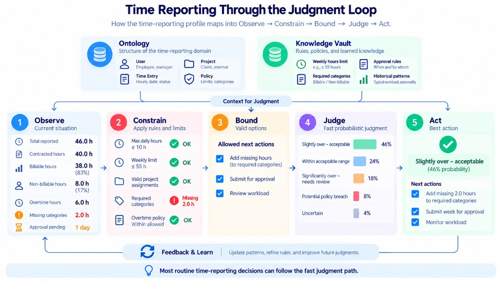

# Judgment framework — NextForge mental model

Turn **what you know at decision time** into action using **decision profiles** (ontology + probabilistic questions).

**Agents:** skill **`simple-judgment-mental-model`** · MCP `nextforge://skills/simple-judgment-mental-model`

---

## Generic judgment loop (all domains)



### Context for judgment

| Layer | Generic model | NextForge |
|-------|---------------|-----------|
| **Ontology** | Entities, relationships, states, capabilities, valid options | `goal`, `state`, `entities`, `outcomes`, `planned_questions` |
| **Knowledge vault** | Business rules, policies & limits, domain knowledge, historical outcomes, examples & patterns | External store + **`policies`**; merge into **`state`** at runtime |

Author in **Define** (profile agent Phase 1).

### Five steps

```text
Observe → Constrain → Bound → Judge → Act
   ↑___________________________________|
        Feedback & learn
```

| Step | Key question | NextForge |
|------|--------------|-----------|
| **Observe** | What is happening now? | **`state`** from caller |
| **Constrain** | What options are allowed? | Deterministic **`policies`**, code checks |
| **Bound** | Narrow to allowed choices | Valid **outcomes** / next actions |
| **Judge** | Likelihood per option? | **Questions** → `try_profile` |
| **Act** | Best valid option | **Outcome** + task list |

**try_profile** runs **Judge** on a published profile. **Constrain / Bound / Act** live in ontology + orchestrator/harness.

---

## Worked example: time reporting



Same loop with concrete numbers and tasks for profile **`time-reporting`**. Other demos (`triage`, `expense-demo`) follow the **generic** diagram with different `state` and questions.

| Diagram detail | Role |
|----------------|------|
| Hours, billable split, missing 2h categories | **Observe** (`state`) |
| Weekly cap, required categories | **Vault** + **Constrain** |
| Add hours, submit, review workload | **Bound** |
| “Slightly over – acceptable” 46% | **Judge** |
| Add 2h, submit, monitor | **Act** |

---

## Observe: supplied `state`

| Source | Rule |
|--------|------|
| Event / case | In **`state`** |
| Vault, RAG, DB | Merged into **`state`** by the app |
| Hard limits | **`policies`** or structured fields |

```text
[vault] ──retrieve──┐
[event] ────────────┼──► state ──► Constrain → Bound → Judge → Act
                    ontology contract
```

---

## Artifacts

| Piece | Where |
|-------|--------|
| Ontology | `domains/<id>/ontology.yml`, Postgres |
| Vault | External; not the profile row |
| Judge | `questions/<id>.yml`, `try_profile` |
| Constrain / Act | `policies`, `outcomes`, app routing |

---

## Profile agent path

Define → validate questions → `publish_profile` → `try_profile` → eval → iterate. See `Demo/README.md`, `AGENTS.md`.

---

## Diagram files

| File | Use |
|------|-----|
| `judgment-loop-generic.jpg` | **Default** mental model (any domain) |
| `judgment-loop-time-reporting.jpg` | **Example** instantiation |

---

## One-line summary

**Generic loop** for every profile; **time-reporting infographic** shows one full walkthrough.

---

## Reverse map: mental model ↔ NextForge profile ↔ profile agent

Two modes—do not mix them in one sentence:

| Mode | Analogy | What happens |
|------|---------|----------------|
| **Authoring** (profile agent) | **Blueprint + instruments** | You design ontology, vault contract, questions; publish to Postgres |
| **Runtime** (one case) | **One flight** | Caller sends `state` → Constrain/Bound (app) → `try_profile` (Judge) → Act (app) |

### Context layer (authoring = **Define**)

| Mental model | NextForge profile | Profile agent (`.cursor/rules/nextforge-profile-agent.mdc`) |
|--------------|-------------------|-------------------------------------------------------------|
| **Ontology** (entities, states, capabilities, valid options) | `ontology_yaml`: `goal`, `state`, `entities`, `outcomes`, `planned_questions` | Phase 1: `build_ontology_from_spec`, `validate_ontology_yaml` |
| **Knowledge vault** (rules, limits, history, patterns) | `policies` + external store; vault text via extra **`state`** fields | Phase 1: mark `deterministic: true` vs `question_id`; document vault in spec |
| *(not in runtime diagram)* | **`id` / `version`** | Intake `preset_id`; `list_profiles` |

### Runtime loop (one decision)

| Mental model step | Profile artifact | Agent / MCP (runtime or test) |
|-------------------|------------------|-------------------------------|
| **1 Observe** | `state` contract + example payloads | **`try_profile`** `state`; `Demo/*/try-examples.json`; fixtures `state` |
| **2 Constrain** | `policies` (especially `deterministic: true`) | Authored in Phase 1; **executed outside** `try_profile` (app/harness) |
| **3 Bound** | `outcomes` still valid after Constrain | Authored in Phase 1; routing logic in app/harness |
| **4 Judge** | `questions_yaml` | **`try_profile`** → Ollaya probabilities |
| **5 Act** | chosen `outcome` + tasks | Documented in ontology; **orchestrator** picks from Judge + policies |
| **Feedback & learn** | — | Phase 4–6: fixtures, `run_harness_eval`, edit YAML, re-`publish_profile` |

### Ollaya lifecycle ↔ judgment loop (authoring)

| Lifecycle phase | Judgment loop (author focus) | Agent skill phase |
|-----------------|------------------------------|-------------------|
| 1 Domain spec | **Define** (ontology + vault) | Ontology |
| 2 Draft questions | **Judge** (instruments) | Questions |
| 3 Validate & fix | **Define** + **Judge** hardening | Validate & optimize |
| 4 Fixtures | Test **Observe → Judge** | Try & eval (setup) |
| 5 Eval report | Measure **Judge** | Try & eval |
| 6 Iterate | **Feedback** → Define/Judge | Iterate |

### Cursor rule (four bullets) ↔ mental model

| Rule line | Mental model meaning |
|-----------|---------------------|
| MCP **`nextforge`** | Runtime API for list/publish/**try_profile**/validate harness |
| Skills **mental model** then **profile agent** | North-star loop, then build/publish workflow |
| Prompts `build_ontology…`, `design_questions…` | **Define** + **Judge** authoring depth |
| Publish only after `validate_*` | Blueprint frozen before Postgres (**Judge** YAML + **Define** ontology) |

### What is aligned vs split

| Aligned (same idea) | Split (two owners) |
|---------------------|---------------------|
| Ontology ↔ structure; questions ↔ Judge | **Constrain / Bound / Act** in mental model; **only Judge** inside `try_profile` |
| `policies` ↔ vault + hard rules | Full vault lives **outside** profile row |
| `publish_profile` = ship blueprint | **Act** on a live case = **your app**, not MCP today |
| Demos = Observe examples + authored Judge | Time-reporting **picture** = aggregate `state`; demo line = simpler `state` |

### One analogy for stakeholders

> **Profile** = sheet music (ontology) + how the soloist should interpret uncertainty (questions).  
> **`try_profile`** = one rehearsal hearing the soloist on a given passage (`state`).  
> **Constrain / Bound / Act** = conductor + venue rules deciding if the concert proceeds and what happens next.

**Profile agent** writes the music and publishes it; it does not replace the conductor unless you implement routing on top of `try_profile` answers.
